# # PAYY，注册即可免费获取虚拟U卡！仅1%的外汇损耗！

# 首先我们还是需要先下载它的这个应用，在安卓上打开[https://payy.link/invite/BMH54V](https://payy.link/invite/BMH54V)点击download app会自动跳转到google play里点击下载即可

# 打开后如下方界面所示
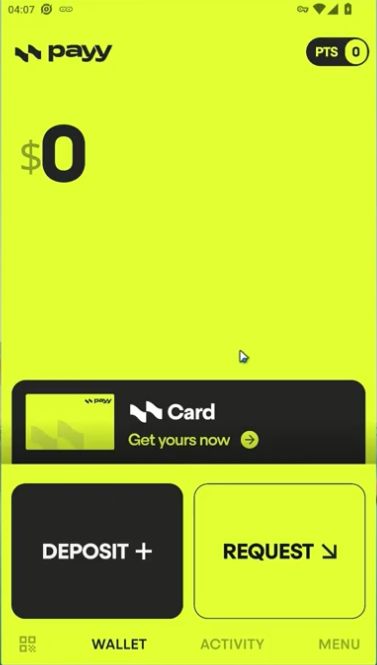
# 点击Get yours now去获取虚拟卡
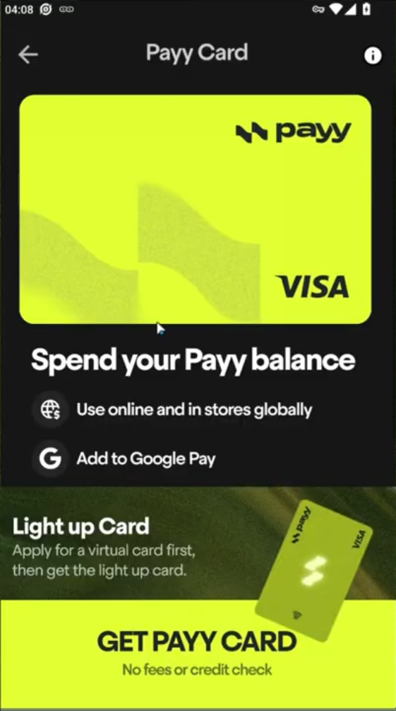
# 点击GET PAYY CARD获取虚拟卡
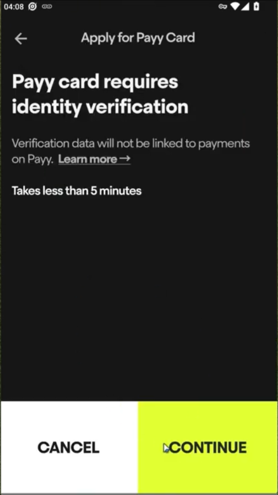
# 点击CONTINUE继续
# First name 是名字 Last name是性氏，使用英文名，例如你叫张三，名字就是 SAN 姓氏是 ZHANG
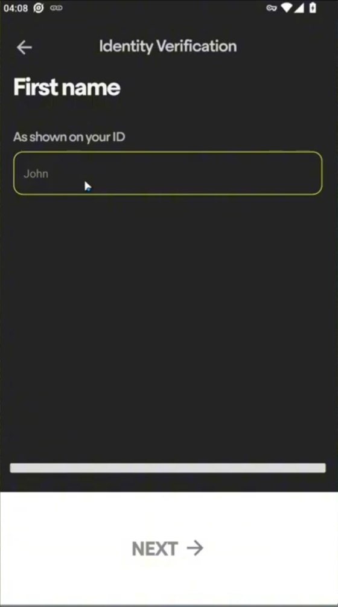
# 在这里要选择中国以外的地区，选择中国会卡住审核
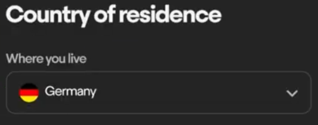
# 输入你所在的邮编即可
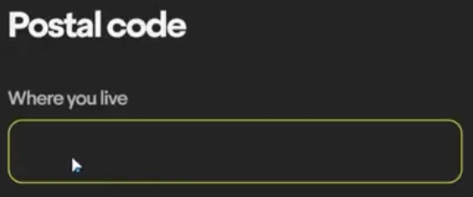
# 输入你所在的州（省）

# 输入你所在的城市

# 输入你的街道地址
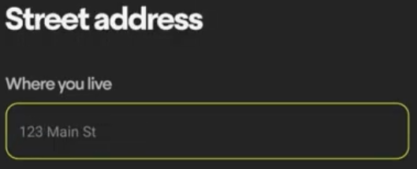
# 输入你的生日
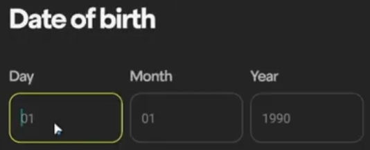
# 输入你的电子邮箱

# 输入你的海外电话号码，中国电话号码无法接收到短信
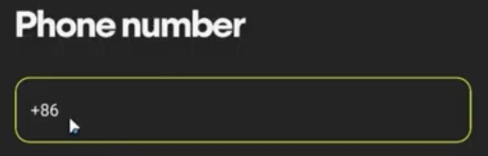
# 选择国籍，选择中国就可以了，如果你有其他的可以自己选择
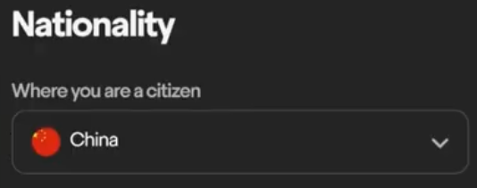
# 这里输入身份信息，如果想用身份证认证就输入身份证号，如果想用护照认证就输入护照的
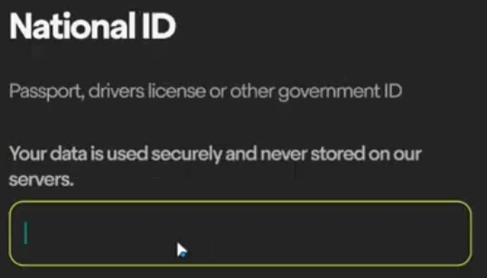
# 选择你的ID所属地区，选择中国即可，如果你有其他的可以自己选择
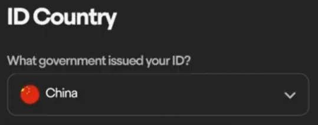
# 提示你可以使用的有护照、身份证、驾照、居住卡
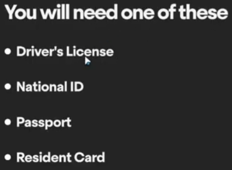
# 然后先拍摄身份证正面，点击下一步后再拍摄身份证反面，如果是护照申请则拍两次正面，然后回到主页，等待审核通过

# 点击这个位置就能看到你获取的虚拟卡了

# 点击底部的获取更多积分
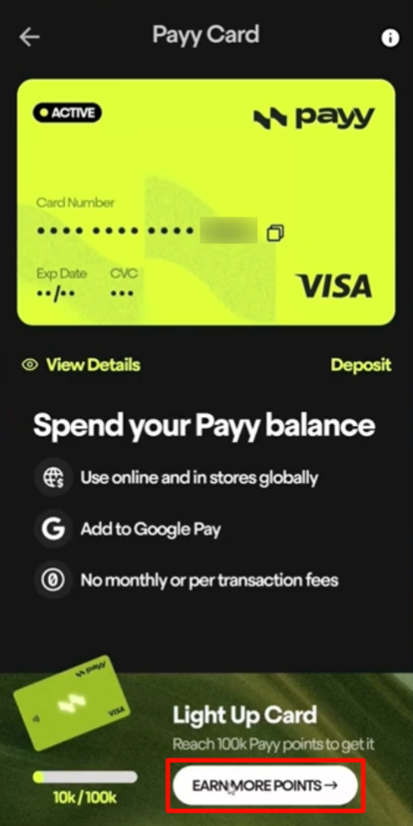
# 往下拉，点击这里输入我的邀请码 BMH54V ，你和我各得1000积分
